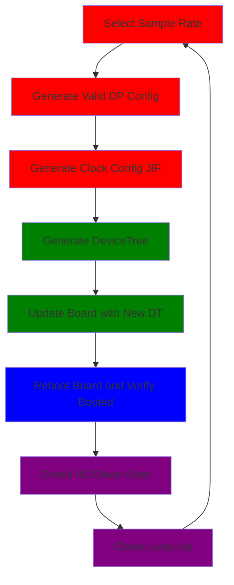

# Workflow 0: Matched Sample Rate Validation

  

The test workflow follows the path in the figure above, by starting with a high-level sample rate then translating that down to the hardware to configuration and validation. This leverages 4 main python libraries:

- $\textcolor{red}{pyadi-jif}$: Configuration generation and validation
- $\textcolor{green}{pyadi-dt}$: DeviceTree Translation
- $\textcolor{purple}{pyadi-iio}$: IIO and SSH access
- $\textcolor{blue}{nebula}$: Hardware management for boot files and UART control
